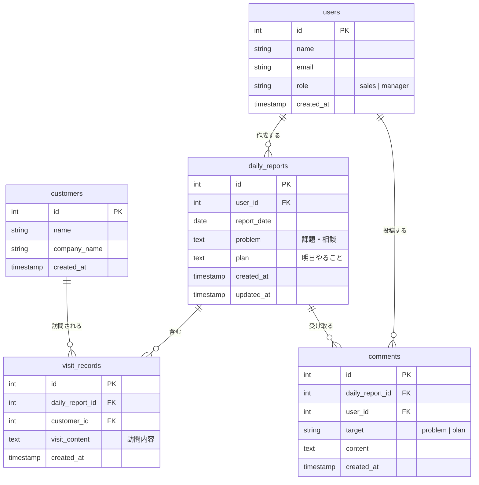

# 営業日報システム 要件定義 & ER図

---

## 1. 登場人物（アクター）

| アクター   | 説明                                             |
| ---------- | ------------------------------------------------ |
| 営業担当者 | 日報を作成し、訪問記録・Problem・Plan を入力する |
| 上長       | 部下の日報を閲覧し、Problem・Plan にコメントする |

---

## 2. 機能要件

### 2-1. マスタ管理

- **ユーザーマスタ** — 営業担当者・上長の登録・編集・削除。ロール（営業 / 上長）を持つ
- **顧客マスタ** — 顧客の登録・編集・削除

### 2-2. 日報

- 営業担当者は **1日1件** の日報を作成できる（report_date + user_id がユニーク）
- 日報には **Problem（課題・相談）** と **Plan（明日やること）** をテキストで記入する

### 2-3. 訪問記録

- 日報に対して **訪問記録を複数行** 追加できる
- 1行 = 顧客1件 ＋ 訪問内容テキスト
- 同じ顧客を1日に複数回訪問した場合も別行で登録可能

### 2-4. コメント

- 上長は日報の **Problem / Plan それぞれ** にコメントを投稿できる
- コメントは複数投稿可能

---

## 3. ER図

---

## 4. 主要制約

| テーブル           | 制約                                                      |
| ------------------ | --------------------------------------------------------- |
| `daily_reports`    | `(user_id, report_date)` にユニーク制約 — 1人1日1件       |
| `comments.target`  | `'problem'` または `'plan'` のみ許容（ENUM or CHECK制約） |
| `comments.user_id` | 上長ロールのみ投稿可（アプリ層またはDB層で制御）          |
