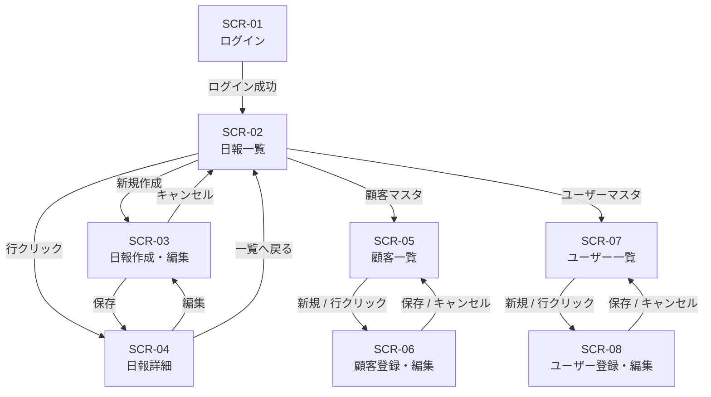

# 営業日報システム 画面定義書

---

## 画面一覧

| 画面ID | 画面名                       | アクセス可能ロール |
| ------ | ---------------------------- | ------------------ |
| SCR-01 | ログイン画面                 | 全員               |
| SCR-02 | 日報一覧画面                 | 全員               |
| SCR-03 | 日報作成・編集画面           | 営業               |
| SCR-04 | 日報詳細画面                 | 全員               |
| SCR-05 | 顧客マスタ一覧画面           | 全員               |
| SCR-06 | 顧客マスタ登録・編集画面     | 上長               |
| SCR-07 | ユーザーマスタ一覧画面       | 上長               |
| SCR-08 | ユーザーマスタ登録・編集画面 | 上長               |

---

## SCR-01 ログイン画面

**目的:** システムへの認証

### 入力項目

| 項目名         | 型       | 必須 | 備考 |
| -------------- | -------- | ---- | ---- |
| メールアドレス | text     | ○    |      |
| パスワード     | password | ○    |      |

### アクション

| ボタン   | 動作                                                 |
| -------- | ---------------------------------------------------- |
| ログイン | 認証成功 → SCR-02へ遷移、失敗 → エラーメッセージ表示 |

---

## SCR-02 日報一覧画面

**目的:** 日報の一覧表示・絞り込み

### 絞り込み条件

| 項目名       | 型     | 備考                                               |
| ------------ | ------ | -------------------------------------------------- |
| 期間（開始） | date   | デフォルト: 当月1日                                |
| 期間（終了） | date   | デフォルト: 今日                                   |
| 営業担当者   | select | 上長のみ表示（自分の部下を選択可）。営業は自分固定 |

### 一覧表示項目

| 項目名                | 備考                 |
| --------------------- | -------------------- |
| 報告日                |                      |
| 営業担当者名          | 上長画面のみ表示     |
| 訪問件数              | visit_records の行数 |
| Problem（先頭50文字） |                      |
| Plan（先頭50文字）    |                      |
| コメント数            |                      |

### アクション

| ボタン/操作    | 動作                                     |
| -------------- | ---------------------------------------- |
| 行をクリック   | SCR-04（日報詳細）へ遷移                 |
| 新規作成ボタン | SCR-03（日報作成）へ遷移（営業のみ表示） |

---

## SCR-03 日報作成・編集画面

**目的:** 日報の新規作成および編集（営業担当者のみ）

### 表示・入力項目

| 項目名 | 型   | 必須 | 備考                               |
| ------ | ---- | ---- | ---------------------------------- |
| 報告日 | date | ○    | 新規時は今日の日付をデフォルト表示 |

#### 訪問記録（複数行）

| 項目名   | 型       | 必須 | 備考               |
| -------- | -------- | ---- | ------------------ |
| 顧客     | select   | ○    | 顧客マスタから選択 |
| 訪問内容 | textarea | ○    |                    |

- 「行を追加」ボタンで行を増やせる
- 「削除」ボタンで各行を削除できる
- 最低1行必須

#### Problem・Plan

| 項目名                | 型       | 必須 | 備考 |
| --------------------- | -------- | ---- | ---- |
| Problem（課題・相談） | textarea | ―    |      |
| Plan（明日やること）  | textarea | ―    |      |

### アクション

| ボタン     | 動作                                        |
| ---------- | ------------------------------------------- |
| 保存       | バリデーション後、日報を保存 → SCR-04へ遷移 |
| キャンセル | 入力内容を破棄してSCR-02へ戻る              |

### バリデーション

- 報告日は必須
- 同じ報告日の日報がすでに存在する場合はエラー（編集時は対象外）
- 訪問記録は1行以上必須、顧客と訪問内容は両方入力必須

---

## SCR-04 日報詳細画面

**目的:** 日報の内容確認とコメント投稿

### 表示項目

| 項目名       | 備考 |
| ------------ | ---- |
| 報告日       |      |
| 営業担当者名 |      |

#### 訪問記録

| 項目名   |
| -------- |
| 顧客名   |
| 訪問内容 |

#### Problem セクション

| 項目名           | 備考                             |
| ---------------- | -------------------------------- |
| Problem テキスト |                                  |
| コメント一覧     | 投稿者名・投稿日時・コメント内容 |
| コメント入力欄   | 上長のみ表示                     |

#### Plan セクション

| 項目名         | 備考                             |
| -------------- | -------------------------------- |
| Plan テキスト  |                                  |
| コメント一覧   | 投稿者名・投稿日時・コメント内容 |
| コメント入力欄 | 上長のみ表示                     |

### アクション

| ボタン       | ロール                 | 動作                                           |
| ------------ | ---------------------- | ---------------------------------------------- |
| 編集ボタン   | 営業（自分の日報のみ） | SCR-03（編集モード）へ遷移                     |
| コメント送信 | 上長                   | Problem または Plan にコメントを保存・画面更新 |
| 一覧へ戻る   | 全員                   | SCR-02へ遷移                                   |

---

## SCR-05 顧客マスタ一覧画面

**目的:** 登録済み顧客の一覧表示

### 絞り込み条件

| 項目名             | 型   |
| ------------------ | ---- |
| 顧客名（部分一致） | text |
| 会社名（部分一致） | text |

### 一覧表示項目

| 項目名 |
| ------ |
| 顧客名 |
| 会社名 |
| 登録日 |

### アクション

| ボタン/操作    | ロール | 動作                 |
| -------------- | ------ | -------------------- |
| 新規登録ボタン | 上長   | SCR-06（新規）へ遷移 |
| 行をクリック   | 上長   | SCR-06（編集）へ遷移 |

---

## SCR-06 顧客マスタ登録・編集画面

**目的:** 顧客の新規登録・情報編集（上長のみ）

### 入力項目

| 項目名 | 型   | 必須 |
| ------ | ---- | ---- |
| 顧客名 | text | ○    |
| 会社名 | text | ○    |

### アクション

| ボタン     | 動作                                                       |
| ---------- | ---------------------------------------------------------- |
| 保存       | バリデーション後、保存 → SCR-05へ遷移                      |
| 削除       | 確認ダイアログ表示 → 削除 → SCR-05へ遷移（編集時のみ表示） |
| キャンセル | SCR-05へ戻る                                               |

### バリデーション

- 顧客名・会社名は必須
- 削除時、対象顧客が訪問記録に紐づいている場合は削除不可（エラーメッセージ表示）

---

## SCR-07 ユーザーマスタ一覧画面

**目的:** 登録済みユーザーの一覧表示（上長のみ）

### 一覧表示項目

| 項目名                |
| --------------------- |
| 氏名                  |
| メールアドレス        |
| ロール（営業 / 上長） |
| 登録日                |

### アクション

| ボタン/操作    | 動作                 |
| -------------- | -------------------- |
| 新規登録ボタン | SCR-08（新規）へ遷移 |
| 行をクリック   | SCR-08（編集）へ遷移 |

---

## SCR-08 ユーザーマスタ登録・編集画面

**目的:** ユーザーの新規登録・情報編集（上長のみ）

### 入力項目

| 項目名         | 型       | 必須 | 備考                                   |
| -------------- | -------- | ---- | -------------------------------------- |
| 氏名           | text     | ○    |                                        |
| メールアドレス | text     | ○    | ユニーク                               |
| パスワード     | password | ○    | 新規時のみ必須、編集時は空欄で変更なし |
| ロール         | select   | ○    | 営業 / 上長                            |

### アクション

| ボタン     | 動作                                                       |
| ---------- | ---------------------------------------------------------- |
| 保存       | バリデーション後、保存 → SCR-07へ遷移                      |
| 削除       | 確認ダイアログ表示 → 削除 → SCR-07へ遷移（編集時のみ表示） |
| キャンセル | SCR-07へ戻る                                               |

### バリデーション

- 氏名・メールアドレス・ロールは必須
- メールアドレスは既存ユーザーと重複不可
- 削除時、自分自身は削除不可

---

## 画面遷移図

